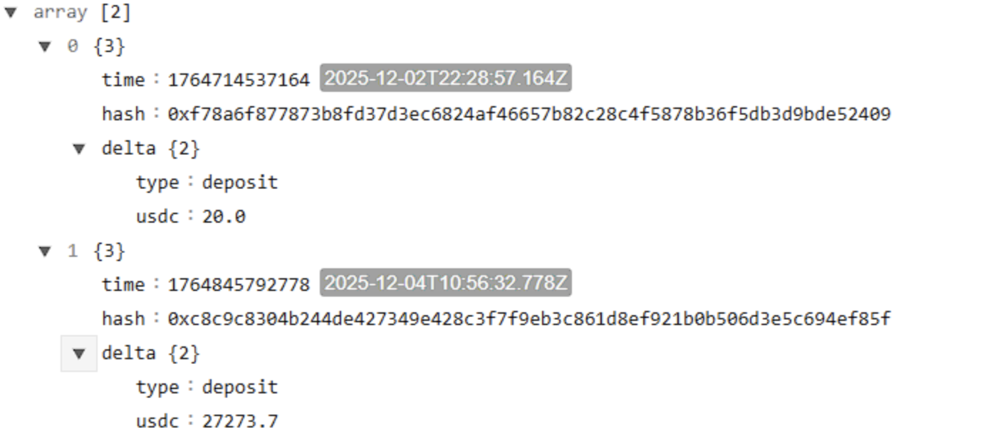
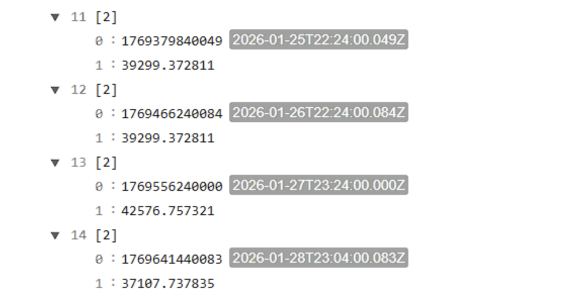
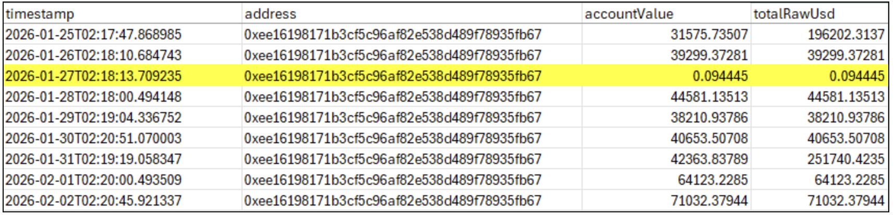
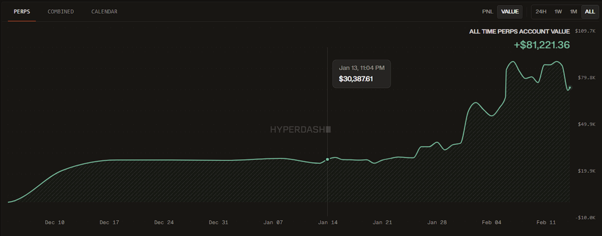
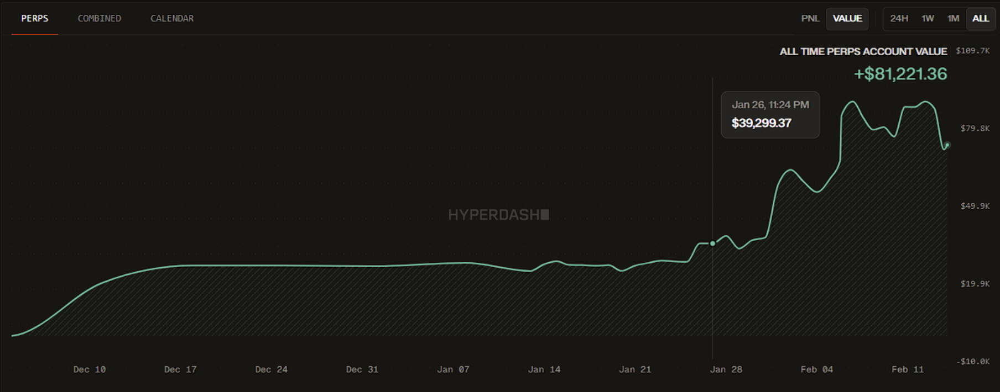
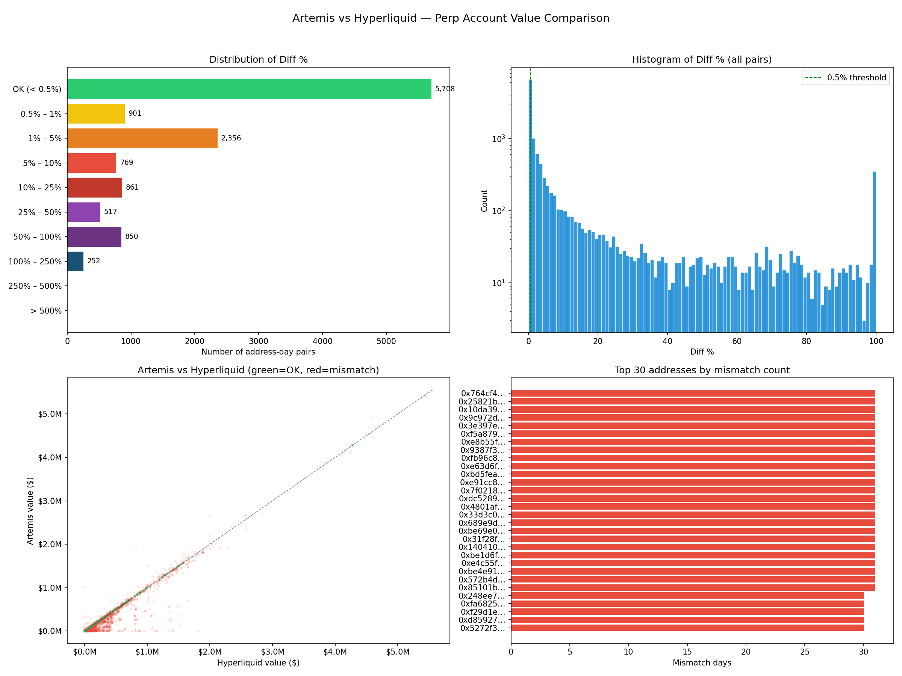
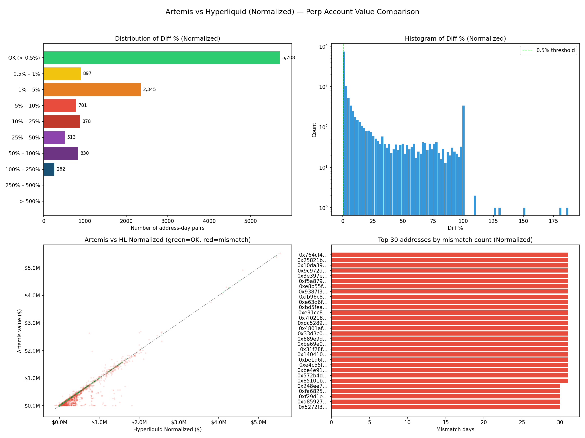

# Hyperliquid User Perp Balance: Artemis vs HL API Data Discrepancy Report

## Acknowledgment
We want to start by thanking the Artemis team for making historical Hyperliquid user-level account data publicly available. At Revio, we use this dataset as part of our on-chain research and analysis workflows, and it has become an important input for understanding trader behavior on Hyperliquid. To our knowledge, Artemis is the only provider making this type of granular, wallet-level perpetual balance data freely accessible -- and that is a significant contribution to the ecosystem.

During our work with this data, we noticed some discrepancies when cross-referencing Artemis snapshots against values returned directly by the Hyperliquid API. We've put together this report and the accompanying code to document what we found, in the hope that it's useful for the Artemis team in investigating and refining the data pipeline.We are sharing this directly with the Artemis team in the hope that it helps with debugging, and we're happy to assist in any way we can.
____________________________________________________________________________
## TL;DR
While working with Artemis's Hyperliquid user balance snapshots, we compared daily account values against the Hyperliquid API (/info endpoint, perpMonth portfolio type) for 390+ wallet addresses over ~30 days. We observed the following:
- Approximately 47.5% of wallet-day pairs match within a 0.5% tolerance -- meaning a meaningful portion of comparisons show differences worth investigating
- On certain days, specific wallets show near-zero balances in Artemis data while the Hyperliquid API (and independent third-party tools like Hyperdash) report normal balances in the tens of thousands of dollars
- These discrepancies persist even after we normalized for deposits, withdrawals, and transfers that may have occurred in the time gap between the two data sources' snapshots

To isolate the issue as clearly as possible, we include a single-wallet deep dive below -- a wallet with only 2 lifetime transactions (both deposits in December 2025), which rules out any flow-based explanation for the January 2026 discrepancies.
____________________________________________________________________________
## Table of Contents
- [Methodology](#methodology)
- [Single-Wallet Deep Dive](#single-wallet-deep-dive)
- [Aggregate Results: Raw Comparison](#aggregate-results-raw-comparison)
- [Aggregate Results: Normalized Comparison](#aggregate-results-normalized-comparison)
- [Repo Structure](#repo-structure)
- [How to Reproduce](#how-to-reproduce)
- [Conclusion and Next Steps](#conclusion-and-next-steps)

____________________________________________________________________________
## Methodology

We designed the comparison to be as fair as possible, accounting for known differences in how and when the two sources capture data.

### Data Sources

| Source | Description | Endpoint / Location |
|---|---|---|
| Artemis S3 | Periodic balance snapshots stored as .jsonl files in the artemis-hyperliquid-data S3 bucket. Each file contains one JSON line per wallet with marginSummary.accountValue. Multiple snapshot files per day under raw/perp_and_spot_balances/YYYY/MM/DD/. We keep the record with the latest timestamp per wallet per day. | s3://artemis-hyperliquid-data/raw/perp_and_spot_balances/ |
| Hyperliquid API | Direct API call using POST https://api.hyperliquid.xyz/info with {"type": "portfolio", "user": "<address>"}. We use the perpMonth key and its accountValueHistory field -- a list of [timestamp_ms, value_string] pairs covering the last month. | https://api.hyperliquid.xyz/info |

### Timestamp Alignment (Step 1)
One of the first things we noticed is that the two sources snapshot at different times of day. Artemis snapshots are taken at ~02:00 UTC (start of the new calendar day), while Hyperliquid's last data point for a given day falls at ~22-23:15 UTC (near end of the same day). Naively comparing values on the same calendar date means comparing snapshots ~21 hours apart -- enough for significant market moves.

Our adjustment: For each output row on date D, we pair Artemis's value from day D with Hyperliquid's value from day D-1. This brings the two snapshots to within ~2-3 hours of each other, which we believe is a fair comparison window.

### Diff Calculation
For each wallet x day pair where both values exist:

```
abs_diff = |Artemis - Hyperliquid|
pct_diff = abs_diff / max(|A|, |B|) x 100
```

We consider anything under 0.5% a match (OK). This is a relatively generous threshold that accounts for minor timing differences and market microstructure.

### Flow Normalization (Step 2)
Even with timestamp alignment, a 2-3 hour gap remains. During that window, deposits, withdrawals, spot-to-perp transfers, and reward claims can change the perp account value without market movement. To account for this:
- We pull each wallet's full ledger of non-funding events using userNonFundingLedgerUpdates
- We classify each event by its effect on perp balance (deposits positive, withdrawals negative, spot-to-perp positive, perp-to-spot negative, rewards positive)
- For each day, we find events in the gap window, sum the net flow: normalized_value = hyperliquid_value + net_flow
- We recompute the diff against Artemis using the normalized value

This ensures that legitimate balance changes from user activity during the gap window are not mistakenly flagged as discrepancies.
____________________________________________________________________________
## Single-Wallet Deep Dive
**Wallet:** `0xee16198171b3cf5c96af82e538d489f78935fb67`

We selected this wallet as our primary example because it has an extremely simple transaction history -- only 2 lifetime non-funding ledger events, both deposits:

| # | Date | Type | Amount (USDC) |
|---|---|---|---|
| 1 | 2025-12-02 | Deposit | 20.0 |
| 2 | 2025-12-04 | Deposit | 27,273.7 |



*Source: Hyperliquid API, userNonFundingLedgerUpdates endpoint*

*Figure 1: NonFundingLedgerUpdates response -- only 2 deposit events, both in December 2025.*

*File: data/Wallet_0xee16198171b3cf5c96af82e538d489f78935fb67_NFLU_From_HL*

Since both deposits occurred in early December 2025 -- well before our January 2026 comparison window -- no deposits, withdrawals, or transfers can explain any discrepancy in the January data. Any mismatch must originate from the data source itself.

### Key Observation: January 26
The Hyperliquid API returns smooth, continuous daily balances reflecting normal trading PnL:

| Date (UTC) | HL Timestamp | HL Account Value ($) |
|---|---|---|
| 2026-01-25 | 2026-01-25T22:24 | 39,299.37 |
| 2026-01-26 | 2026-01-26T22:24 | 39,299.37 |
| 2026-01-27 | 2026-01-27T23:24 | 42,576.76 |
| 2026-01-28 | 2026-01-28T23:04 | 37,107.74 |



*Source: Hyperliquid API*

*Figure 2: Hyperliquid API accountValueHistory around Jan 25-28 -- stable values, no anomalous drops.*

*File: data/Wallet_0xee16198171b3cf5c96af82e538d489f78935fb67_AccountValue_HL*

Artemis S3 reports this wallet's account value on January 26 (27) as $0.09:

| Date | Artemis Timestamp (UTC) | Artemis accountValue ($) | Comparable HL Value ($) | HL Date (D-1) | Discrepancy |
|---|---|---|---|---|---|
| 2026-01-26 | 2026-01-27T02:18:13 | 0.09 | 39,299.37 | Jan 26 (22:24 UTC) | ~100% |


Artemis's Jan 26 snapshot (taken at 01-27T02:18:13 UTC) is only ~4 hours after Hyperliquid's Jan 26 value (taken at ~22:24 UTC). Given zero NonFunding wallet activity during this window and the following timestamp data, these values should be very close -- not off by ~$39,000.



*Source: Artemis S3 Hyperliquid Data*

*Figure 3: Artemis snapshot data in spreadsheet view: the row for Jan 27 highlighted showing accountValue of $0.09 while surrounding days show normal ~$30,000-40,000 balances.*

*File: data/0xee16198171b3cf5c96af82e538d489f78935fb67_perps_account_summary.csv*

### Independent Confirmation via Hyperdash
To further validate, we checked this wallet's all-time perps account value chart on Hyperdash, an independent Hyperliquid analytics platform. The chart shows a smooth, continuous equity curve through both the Jan 13-14 and Jan 26-27 periods with no significant drops at any point -- confirming the Hyperliquid API data and ruling out any actual account value collapse on those dates.



*Source: Hyperdash; https://hyperdash.com/address/0xee16198171b3cf5c96af82e538d489f78935fb67*

*Figure 4a: Hyperdash all-time perps account value chart showing $30,387.61 on Jan 13, 11:04 PM -- no drop visible.*



*Source: Hyperdash; https://hyperdash.com/address/0xee16198171b3cf5c96af82e538d489f78935fb67*

*Figure 4b: Hyperdash all-time perps account value chart showing $39,299.37 on Jan 26, 11:24 PM -- perfectly matching the Hyperliquid API value. No drop visible around this date.*

### Additional Anomaly: January 13
A similar pattern appears on January 13-14, where Artemis reports an accountValue of $7.03 (at 2026-01-14 02:16:51 UTC). While the Hyperliquid API perpMonth response, at the time of our request, does not cover this date (the 30-day window starts at Jan 14 22:04 UTC), both Hyperdash and the surrounding Artemis data confirm the account was valued at ~$30,000+ on adjacent days. The Hyperdash chart (Figure 4a) shows $30,387.61 on Jan 13 at 11:04 PM with no drop into Jan 14.

### Summary
For this wallet, the Hyperliquid API, Hyperdash, and Artemis's own surrounding-day data all agree on account values in the $30,000-40,000 range during January. The near-zero values on Jan 13/4 and Jan 26/7 in the Artemis snapshots appear to be isolated anomalies -- which is why we wanted to bring them to attention.

____________________________________________________________________________
## Aggregate Results: Raw Comparison
Across 390+ wallets and ~30 days (~12,200 address-day pairs), the raw comparison (with timestamp alignment but before flow normalization) shows:

| Diff Bucket | Count | % of Total |
|---|---|---|
| OK (< 0.5%) | 5,708 | 47.5% |
| 0.5% - 1% | 901 | 7.5% |
| 1% - 5% | 2,356 | 19.6% |
| 5% - 10% | 769 | 6.4% |
| 10% - 25% | 861 | 7.2% |
| 25% - 50% | 517 | 4.3% |
| 50% - 100% | 850 | 7.1% |
| 100% - 250% | 252 | 2.1% |



*Figure 5: Aggregate raw analysis -- (top-left) distribution of diff by bucket, (top-right) histogram on log scale, (bottom-left) scatter plot Artemis vs HL green=OK / red=mismatch, (bottom-right) top 30 addresses by mismatch day count.*

Key observations:
- Less than half of all address-day pairs fall within the 0.5% OK threshold
- The scatter plot shows a strong diagonal but with significant red scatter, especially at lower account values
- Some addresses in the top-30 mismatch list show discrepancies on nearly every day in the sample, which may point to a systematic pattern for certain wallet types or snapshot conditions

____________________________________________________________________________
## Aggregate Results: Normalized Comparison
After flow normalization (adjusting for deposits, withdrawals, and transfers in the 2-3 hour gap), results improve but substantial discrepancies remain:



*Figure 6: Normalized analysis -- same layout as Figure 5 after adjusting HL values for in-gap flows.*

The normalization fixes some previously flagged pairs where legitimate gap-window flows changed the balance. However, the core pattern persists -- wallets with near-zero phantom balances still show them after normalization, confirming these are not flow-related artifacts.
____________________________________________________________________________
## Repo Structure
```
hl-artemis-perp-balance/
|
+-- README.md                              # This report
|
+-- scripts/
|   +-- extraction_data.py                 # Pulls from Artemis S3 + HL API, day-shift alignment
|   +-- normalize_data.py                  # Fetches ledger events, adjusts for in-gap flows
|   +-- analysis.py                        # Raw comparison analysis and charts
|   +-- analysis_normalized.py             # Normalized comparison analysis and charts
|
+-- data/
|   +-- outlier_address.csv                # 396 wallet addresses analyzed
|   +-- 0xee16198171b3cf5c96af82e538d489f78935fb67_perps_account_summary.csv   # perps_acc_summary
|   +-- Wallet_0xee16198171b3cf5c96af82e538d489f78935fb67_NFLU_From_HL.json    # HL API NonFundingLedgerUpdates response
|   +-- Wallet_0xee16198171b3cf5c96af82e538d489f78935fb67_AccountValue_HL.json  # HL API AccountValue response
|   +-- comparison_output.json             # Raw comparison results (generated)
|   +-- comparison_output_normalized.json  # Normalized results (generated)
|
+-- images/
|   +-- analysis_charts.png                # Raw analysis charts (generated)
|   +-- analysis_charts_normalized.png     # Normalized analysis charts (generated)
|   +-- image_1.png                        # NonFundingLedgerUpdates screenshot
|   +-- image_2.png                        # HL API accountValueHistory screenshot
|   +-- image_3.png                        # Artemis snapshot data screenshot
|   +-- image_4a.png                       # Hyperdash chart - Jan 13
|   +-- image_4b.png                       # Hyperdash chart - Jan 26
|
+-- .gitignore
+-- requirements.txt                       # boto3, requests
```

We've included all scripts so that anyone -- including the Artemis team -- can reproduce the analysis against a fresh set of wallets or a different time window. 
____________________________________________________________________________
## How to Reproduce
```bash
# 1. Install dependencies
pip install -r requirements.txt
# 2. Extract data from both sources
python scripts/extraction_data.py
# 3. Normalize for in-gap flows
python scripts/normalize_data.py
# 4. Generate analysis charts
python scripts/analysis.py
python scripts/analysis_normalized.py
```

The Artemis S3 bucket (artemis-hyperliquid-data) is public. The Hyperliquid API requires no authentication.

____________________________________________________________________________
## Conclusion and Next Steps
We put this analysis together because we genuinely rely on Artemis's Hyperliquid data in our day-to-day research, and we want it to be as accurate as possible. The discrepancies we've documented -- particularly the cases where account values drop to near-zero on isolated days -- could have a meaningful impact on anyone using this data for portfolio tracking, risk analysis, or trader behavior research.

We want to be clear that we're not speculating on root causes. There may be nuances in the Artemis snapshot pipeline that we're not aware of, and we recognize that indexing data from Hyperliquid at this granularity is a complex challenge. What we can say is that the single-wallet example (with only 2 lifetime deposits and independent confirmation from both the Hyperliquid API and Hyperdash) demonstrates that certain data points don't reflect the actual on-chain state.

We're sharing this publicly to:
- Provide a documented, reproducible starting point for investigation
- Offer our help -- we're happy to run additional checks, test against different wallet sets, or assist with validation once any fixes are in place

If anyone from the Artemis team would like to discuss this further, we'd welcome the conversation.
____________________________________________________________________________
## Contact
Revio -- [revio.xyz](https://www.revio.xyz); GitHub: [revio-trading](https://github.com/revio-trading) ; info@revio.xyz

X  – [@revio_xyz](https://x.com/revio_xyz); [@marevi0](https://x.com/marevi0)
____________________________________________________________________________

*Report generated: February 2026*
